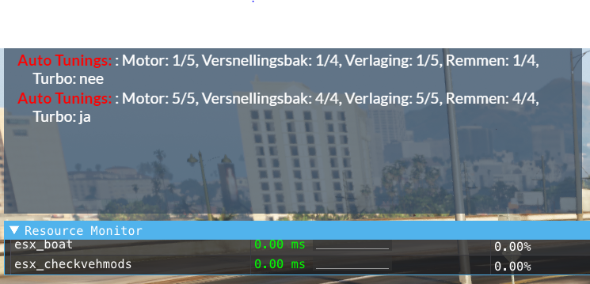

# ESX Check Vehicle Modifications


### Functionaliteiten

- Client kan voertuig tunings bekijken van de wagen waar hij inzit.
- Resource Monitor = 0.00ms.


### Commands
```
/checkiftuning -- geeft auto tunings weer in chat aan de vragende client.
```

### Dependencies

- es_extended


Gemaakt voor GroningenRP.

### Foto

